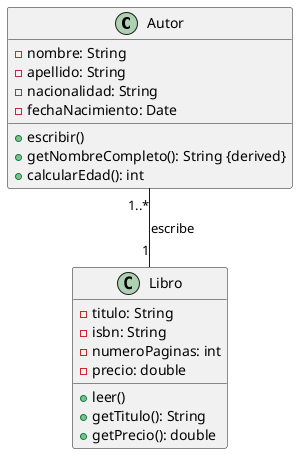

# Solución: Ejercicio 1 - Diagrama de Clases - Libros y Autores

## Clases principales

1. Autor
   - Atributos (privados):
     - -nombre: String
     - -apellido: String
     - -nacionalidad: String
     - -fechaNacimiento: Date
   - Métodos (públicos):
     - +escribir(): void
     - +getNombreCompleto(): String {derived}
     - +calcularEdad(): int

2. Libro
   - Atributos (privados):
     - -titulo: String
     - -isbn: String
     - -numeroPaginas: int
     - -precio: double
   - Métodos (públicos):
     - +leer(): void
     - +getTitulo(): String
     - +getPrecio(): double

## Relaciones

- Autor 1..* "escribe" --- 1 Libro
  - Rol desde Autor: escribe
  - Cardinalidad: Autor 1..* -> Libro 1
  - Navegabilidad: Autor -> Libro (el autor puede listar los libros que escribe)

## Notas

- getNombreCompleto() es un atributo derivado (nombre + " " + apellido).
- Atributos privados con "-" y métodos públicos con "+" siguiendo UML.

## PlantUML

