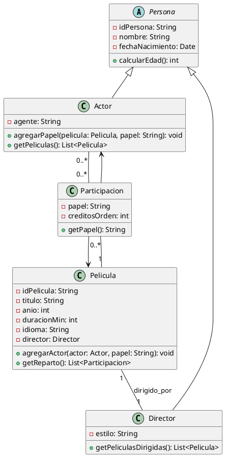

# Solución: Ejercicio 9 - Diagrama de Clases - Películas

## Resumen del dominio

Sistema para registrar películas, directores y actores. Se requiere calcular edades (atributo derivado), buscar películas por año/director/actor, y modelar la relación N:M Actor-Película mediante una clase de asociación que almacene el papel interpretado.

## Clases principales

- Persona (abstracta)
  - -idPersona: String
  - -nombre: String
  - -fechaNacimiento: Date
  - +calcularEdad(): int {derived}

- Actor extends Persona
  - -agente: String (opcional)
  - +agregarPapel(pelicula: Pelicula, papel: String): void
  - +getPeliculas(): List<Pelicula>

- Director extends Persona
  - -estilo: String (opcional)
  - +getPeliculasDirigidas(): List<Pelicula>

- Pelicula
  - -idPelicula: String
  - -titulo: String
  - -anio: int
  - -duracionMin: int
  - -idioma: String
  - -director: Director
  - +agregarActor(actor: Actor, papel: String): void
  - +getReparto(): List<Participacion>
  - +buscarPorActor(actor: Actor): boolean

- Participacion (clase de asociación entre Actor y Pelicula)
  - -papel: String
  - -creditosOrden: int (opcional)
  - +getPapel(): String
  - Asociación conecta 1 Actor <-> 1 Pelicula

## Relaciones y cardinalidades

- Persona (abstracta) generaliza a Actor y Director.
- Pelicula "1" -- "1" Director : dirigido_por
  - Un director puede dirigir 0..* películas.
- Pelicula "1..*" -- "0..*" Actor mediante Participacion
  - Cada Pelicula tiene 1..* actores (al menos uno).
  - Un Actor puede participar en 0..* películas.
- Participacion liga Actor y Pelicula y contiene el atributo `papel`.

## Métodos útiles sugeridos

- Pelicula: +calcularEdadPromedioReparto(): double
- Actor/Director: +calcularEdad(): int
- Sistema (si se modela): +buscarPeliculasPorAnio(anio: int): List<Pelicula>, +buscarPorDirector(d: Director): List<Pelicula>, +buscarPorActor(a: Actor): List<Pelicula>

## PlantUML

## Observaciones

- Participacion es la clase de asociación que almacena el papel interpretado, y permite añadir atributos propios (por ejemplo orden de créditos).
- calcularEdad() se implementa como atributo derivado a partir de fechaNacimiento.
- Se recomienda proporcionar métodos de búsqueda y utilidades en una clase fachada o servicio (por ejemplo CatalogoPeliculas) para realizar consultas por año, director o actor.